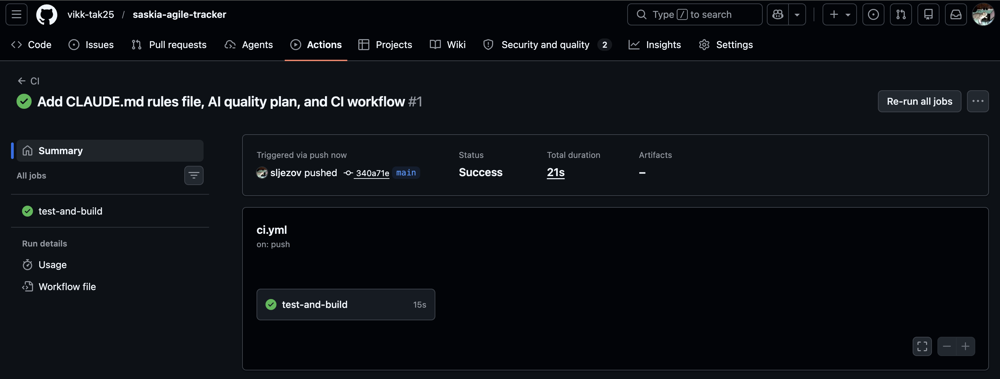

# AI Quality Plan

## CI status



First run: commit `340a71e`, triggered via push to `main` — **Success** in 21 s (`npm test` 11/11 pass + `npm run build` OK).

---

## 1. Which AI rules file was chosen and why?

`CLAUDE.md` — the project is developed using Claude Code (Anthropic's CLI), so `CLAUDE.md` is the natively supported rules file that Claude Code loads automatically at the start of every session. It is scoped to this project directory and does not require any extra configuration. `AGENTS.md` would work for other agents; `.github/copilot-instructions.md` is GitHub Copilot-specific. `CLAUDE.md` is the right choice here.

---

## 2. Sources used

1. **Claude Code documentation — Memory and CLAUDE.md** ([docs.anthropic.com/en/docs/claude-code/memory](https://docs.anthropic.com/en/docs/claude-code/memory)) — explains the `CLAUDE.md` format, which files Claude reads automatically, and how project-level rules differ from user-level memory.
2. **Project `package.json` and `README.md`** — exact script names (`npm run dev`, `npm test`, `npm run build`), actual stack (Vite, Express 5, Node built-in test runner). Read directly from the repository.
3. **`server/storyStore.js` and `tests/api.test.js`** — validation rules (required fields, status enum, points constraints) and test structure (`before`/`after` data restore, sequential `concurrency: false`). Read directly to make rules concrete rather than generic.
4. **OWASP Top 10** ([owasp.org/www-project-top-ten](https://owasp.org/www-project-top-ten/)) — informed the security rules section: A03 Injection → server-side input validation; A09 Security Logging → no logging of request bodies; A05 Security Misconfiguration → do not disable CORS or auth middleware.
5. **GitHub Actions documentation** ([docs.github.com/en/actions](https://docs.github.com/en/actions)) — workflow syntax (`on: push/pull_request`, `jobs`, `steps`) for `.github/workflows/ci.yml`. **GitHub branch protection documentation** ([docs.github.com/en/repositories/configuring-branches-and-merges-in-your-repository/managing-protected-branches/about-protected-branches](https://docs.github.com/en/repositories/configuring-branches-and-merges-in-your-repository/managing-protected-branches/about-protected-branches)) — required status checks, pull request reviews, block direct push to `main`.

---

## 3. Biggest risks when developing with AI

| Risk | Why it matters for this project |
|---|---|
| Silent schema changes | `storyStore.js` validates payload shape. An AI "cleaning up" field names breaks the frontend and existing data in `stories.json`. |
| Broken data restore in tests | `tests/api.test.js` uses `before`/`after` to save and restore `data/stories.json`. If an AI removes or restructures these hooks, tests start mutating production data. |
| Inventing a lint script | There is no ESLint in this project. An AI might add one, pick wrong rules, and break the workflow for other contributors. |
| Changing route paths | The frontend hardcodes `/api/stories`, `/api/stories/:id/status`, etc. An AI renaming a route breaks the UI without a visible test failure (API tests would also need updating). |
| Over-scoped changes | A bug fix in one route becoming a refactor of `storyStore.js` — introducing regressions in untouched functionality. |

---

## 4. How the rules prevent broken code reaching `main`

- **Checklist before completion** — requires `npm test` and `npm run build` to pass, so the AI cannot declare a task done with failing tests or a broken build.
- **Regression test requirement** — every bug fix must add a test that fails before the fix, making regressions detectable automatically in future.
- **Scope control rules** — prohibit touching more than 5 files without explanation and forbid renaming public API contracts (routes, field names, status values).
- **Branch + PR rules** — no direct commits to `main`; PR description must list every changed file.
- **"When unsure" rules** — require the AI to stop and ask before touching validation logic, the test lifecycle hooks, or the data schema.

> Note: `CLAUDE.md` alone does not enforce these rules technically. The complete protection layer requires: branch protection on `main` (block direct push, require passing CI), a CI workflow that runs `npm test` and `npm run build` on every PR, and at least one human code review before merge.

---

## 5. Commands that must pass before a change is complete

```bash
npm test         # 11 API tests — must all pass
npm run build    # Vite build — must exit 0 (catches missing imports, syntax errors)
```

There is no lint or type-check step in this project today. If either command above fails, the work is not done.

---

## 6. How to ensure existing functionality does not break

1. **Full test suite on every change** — `npm test` covers all 11 REST endpoints including error cases (400, 404), happy paths (201, 200, 204), and sequential ordering.
2. **Regression tests on bug fixes** — each fix adds a test case, so the same bug cannot silently reappear.
3. **Scope control** — rules explicitly prohibit modifying `storyStore.js` functions that are not part of the task, preventing accidental side effects.
4. **Data restore hooks** — `tests/api.test.js` already restores `data/stories.json` after every test run; the rules require keeping this mechanism intact.
5. **Build check** — `npm run build` catches import path errors and broken module references that tests do not exercise (frontend bundle).

---

## 7. Rules that require additional technical support

| Rule | Needs |
|---|---|
| "Never commit to `main`" | **Branch protection** on GitHub: block direct push to `main`, require pull request |
| "Do not mark done if `npm test` fails" | **CI workflow** (GitHub Actions): run `npm test` on every pull request, block merge on failure |
| "Do not mark done if `npm run build` fails" | **CI workflow**: run `npm run build` in the same CI job |
| "At least one review before merge" | **Branch protection**: require at least 1 approving review |
| "List every changed file in PR description" | **PR template** (`.github/pull_request_template.md`): prompt contributor to fill in changed files checklist |

Without these technical controls, the `CLAUDE.md` rules are advisory only — they guide the AI but do not prevent a bad commit from landing in `main` if the AI or a human bypasses the guidance.

---

## Self-assessment

**Most useful rule:** The completion checklist (`npm test` + `npm run build` must both pass). It makes "done" a verifiable state rather than a judgment call, and it catches two categories of failure — logic errors (tests) and build-time errors (build) — that different tools catch differently.

**Known contradiction — setup commits went directly to `main`:** The `CLAUDE.md` rule "never commit directly to `main`" was broken by the very commits that added these files. This happened because branch protection was not yet enabled at that point. This reduces the credibility of the Git workflow rule: a rule that was bypassed on day one needs a technical gate to have any real effect. The fix is to enable branch protection on `main` immediately (Settings → Branches → Add rule: require PR, require CI to pass, block direct push).

**Risk that remains:** No automated lint or type check exists. A style inconsistency or a subtle JavaScript runtime error (e.g. calling a method on `undefined`) will not be caught unless it is exercised by an existing test. Adding ESLint with a minimal `eslint:recommended` config would close this gap without requiring TypeScript.

**What to improve next:** Enable GitHub branch protection on `main` (block direct push, require 1 review, require CI green). Add `.github/pull_request_template.md` so every PR prompts the contributor to confirm tests passed and list changed files — the template is already referenced in section 7 as a required technical control.
