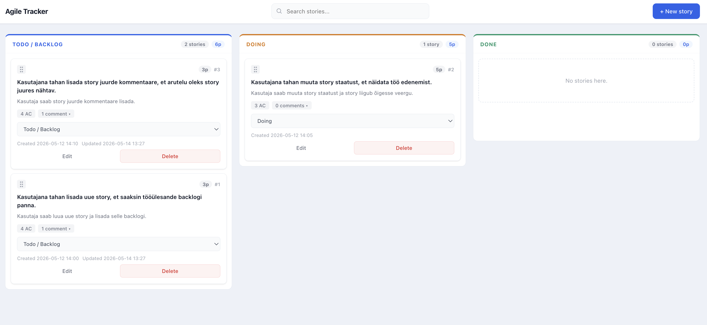

# Agile Tracker

Kanban-laual põhinev veebirakendus kasutajalugude (story'de) haldamiseks.



---

## 1. Tehnoloogiad

| Kiht | Tehnoloogia |
|------|-------------|
| Frontend | Vanilla JavaScript (ES modules), HTML, CSS |
| Bundler | Vite |
| Backend | Node.js, Express |
| Andmesalvestus | JSON-fail (`data/stories.json`) |

---

## 2. Käivitamine

**Eeldused:** Node.js 18+

```bash
# Sõltuvuste paigaldamine
npm install

# Arendusserveri käivitamine (frontend + backend korraga)
npm run dev

# REST API testide käivitamine
npm test
```

- Frontend: [http://localhost:5173](http://localhost:5173)
- REST API: [http://localhost:3000](http://localhost:3000)

---

## 3. Valmis funktsionaalsused

### Kohustuslik funktsionaalsus
- Story'de kuvamine kolmes Kanban-veerus (Todo / Backlog, Doing, Done)
- Story lisamine modaalvormi kaudu
- Story muutmine (pealkiri, kirjeldus, staatus, punktid, vastuvõtutingimused)
- Story kustutamine
- Story staatuse muutmine dropdown-menüü kaudu
- Backlogi järjestamine hiirega lohistades — järjekord säilib pärast lehe uuendamist
- Punktide määramine (täisarv, mitte negatiivne, kohustuslik)
- Vastuvõtutingimuste lisamine (vähemalt üks kohustuslik)
- Kommentaaride lisamine koos automaatse lisamise ajaga
- Andmete salvestamine JSON-faili
- Story'de haldamine REST API kaudu

### Lisavõimalused
- Korrektne ja arusaadav kujundus (navbar, modal, kaardivaade)
- Otsing story pealkirja järgi
- Punktide summa iga veeru päises
- Story loomise ja viimase muutmise kuupäev kaardil
- Kommentaaride kustutamine
- Drag-and-drop story liigutamiseks kõigi veergude vahel
- Sobivad HTTP staatusekoodid API vigade korral (400, 404, 500)
- 11 automaattesti REST API jaoks (`npm test`)

---

## 4. Pooleli jäänud funktsionaalsused

- Story detailvaade (eraldi leht või suurem modal)
- Filtreerimine staatuse või punktide järgi

---

## 5. Keerulisemad kohad

**Drag-and-drop ja prioriteetide sünkroniseerimine.** Kõige keerulisem oli tagada, et hiirega lohistamise järjekord salvestuks õigesti ka pärast lehe uuendamist. Prioriteedi väli tuli laiendada kõigile staatustele (mitte ainult todo-le), ning drag ghost image'i välimus nõudis `setTimeout` triki kasutamist, et brauser jõuaks pildi salvestada enne, kui kaardile rakendatakse `opacity: 0.35`.

**Veergude vaheline drag-and-drop.** `dragover` sündmus tuleb tühistada (`event.preventDefault()`) igas kaadris, mis tegi raske eristada, kas kursor on sama veeru kohal (reorder) või teise veeru kohal (staatuse muutmine).

**Otsing ilma fookuse kaotuseta.** Iga tähe trükkimisel täielik `renderApp()` kutsus lehe ümber joonistamise, mis kaotas input-välja fookuse. Lahendus: otsinguvälja sisestusel uuendatakse ainult `.board` innerHTML, mitte kogu leht.

---

## 6. API endpointid

| Meetod | URL | Kirjeldus |
|--------|-----|-----------|
| `GET` | `/api/stories` | Kõigi story'de nimekiri |
| `GET` | `/api/stories/:id` | Ühe story andmed ID järgi |
| `POST` | `/api/stories` | Uue story loomine |
| `PUT` | `/api/stories/:id` | Story täielik uuendamine |
| `DELETE` | `/api/stories/:id` | Story kustutamine |
| `PATCH` | `/api/stories/:id/status` | Story staatuse muutmine |
| `PATCH` | `/api/stories/reorder` | Veeru järjekorra salvestamine |
| `POST` | `/api/stories/:id/comments` | Kommentaari lisamine |
| `DELETE` | `/api/stories/:id/comments/:commentId` | Kommentaari kustutamine |

### Näidisandmestruktuur

```json
{
  "id": 1,
  "title": "Kasutajana tahan lisada uue story",
  "description": "Kasutaja saab luua uue story ja lisada selle backlogi.",
  "status": "todo",
  "points": 3,
  "priority": 1,
  "acceptanceCriteria": [
    "Vormis saab sisestada pealkirja.",
    "Salvestamisel ilmub story Todo veergu."
  ],
  "comments": [
    {
      "id": 1,
      "text": "Seda tuleb testida.",
      "createdAt": "2026-05-12 14:32"
    }
  ],
  "createdAt": "2026-05-12 14:00",
  "updatedAt": "2026-05-12 14:32"
}
```
